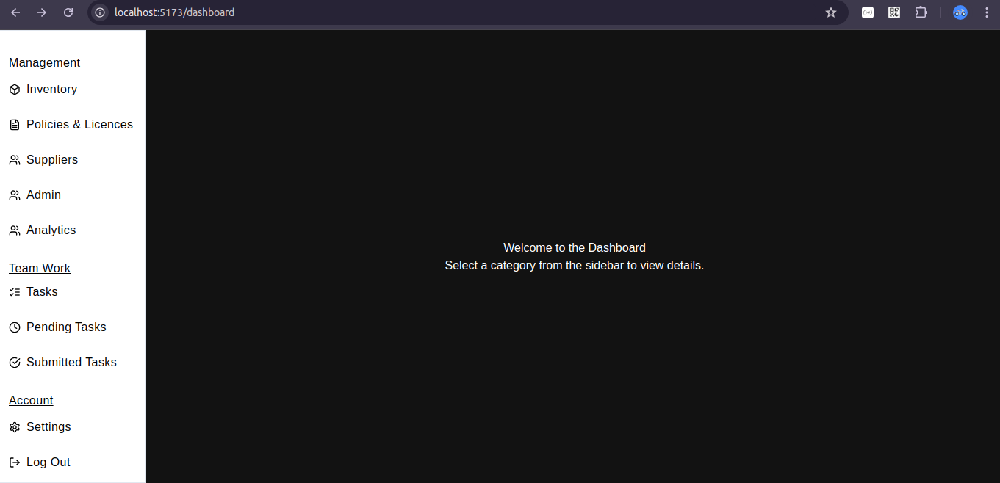
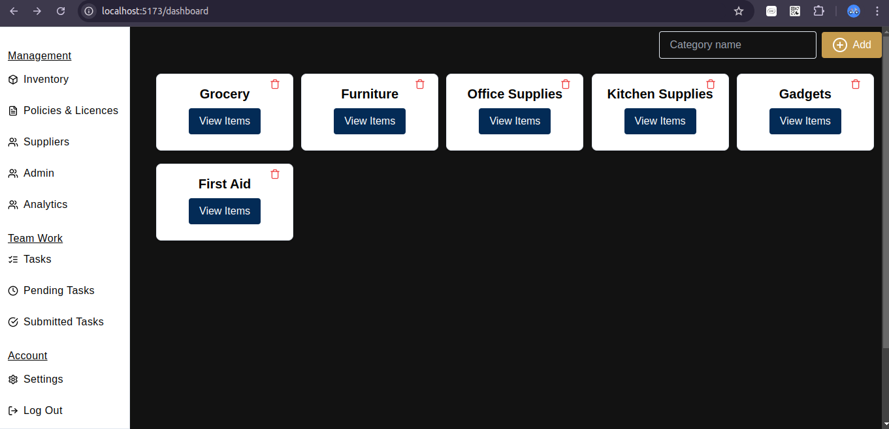
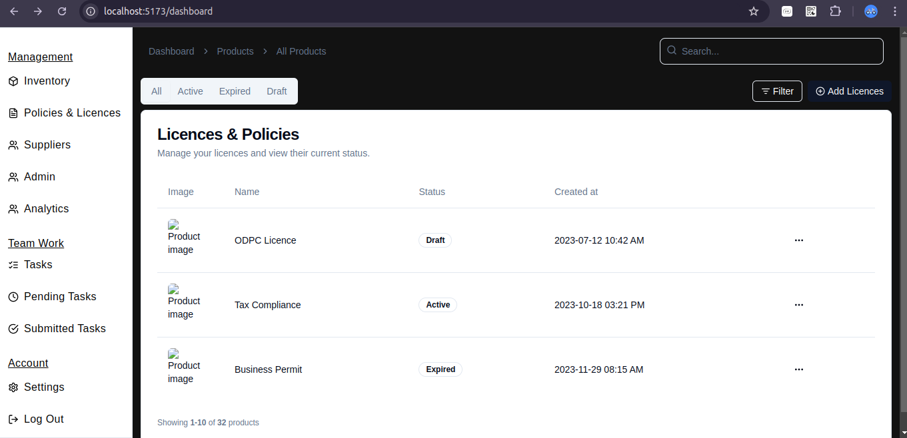

# **BusinessAdmin**

## **Table of Contents**

1. [Overview](#overview)
2. [Features](#features)
3. [Technologies Used](#technologies-used)
4. [Getting Started](#getting-started)
7. [Snapshots](#snapshots)
10. [Contributing](#contributing)
11. [License](#license)
12. [Acknowledgements](#acknowledgements)

---

## **Overview**

This project is an inventory management system designed to keep detailed records of office contents, manage licenses, and ensure policy compliance. It helps organizations streamline their administrative processes by offering an easy-to-use interface for tracking and managing assets.

---

## **Features**


- **Inventory Tracking**: Keep a record of all office assets and their status.
- **License Management**: Monitor and manage software licenses, ensuring compliance.
- **Policy Management**: Track policy documents and receive alerts for renewals.
- **User-Friendly Interface**: A responsive design that works seamlessly across devices.

---

## **Technologies Used**

[Mention the major technologies and tools used in the project.]

- **Frontend**: React, Tailwind CSS
- **Backend**: Django, Django REST framework
- **Database**: SQLite 
- **API**: RESTful APIs with JWT authentication

---

## **Getting Started**


### **Prerequisites**

- **Node.js**: [Download & Install Node.js](https://nodejs.org/)
- **Python**: Ensure Python 3.8+ is installed.
- **Django**: Install Django using `pip install django`.


## **Snapshots**


- **Dashboard View**:

    

- **Inventory Management**:

    

- **License Management**:

    

---


## **Contributing**


1. Fork the repository.
2. Create a new branch:

    ```sh
    git checkout -b feature-branch
    ```

3. Make your changes.
4. Commit your changes:

    ```sh
    git commit -m "Add feature"
    ```

5. Push to the branch:

    ```sh
    git push origin feature-branch
    ```

6. Create a pull request.

---

## **License**


This project is licensed under the MIT License - see the [LICENSE](LICENSE) file for details.

---

## **Acknowledgements**

- **Special Thanks**: Thanks to the team at Dotsavvy for their support and feedback.
- **Special Thanks**: Thanks to [@Lewis](https://github.com/lewis-andy) for their assistance with setting up the initial project structure.